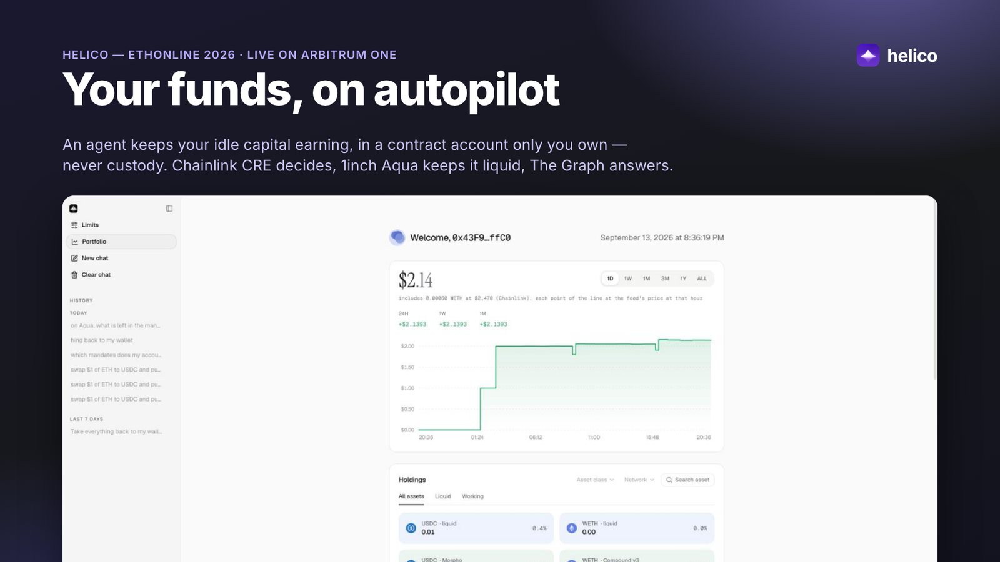
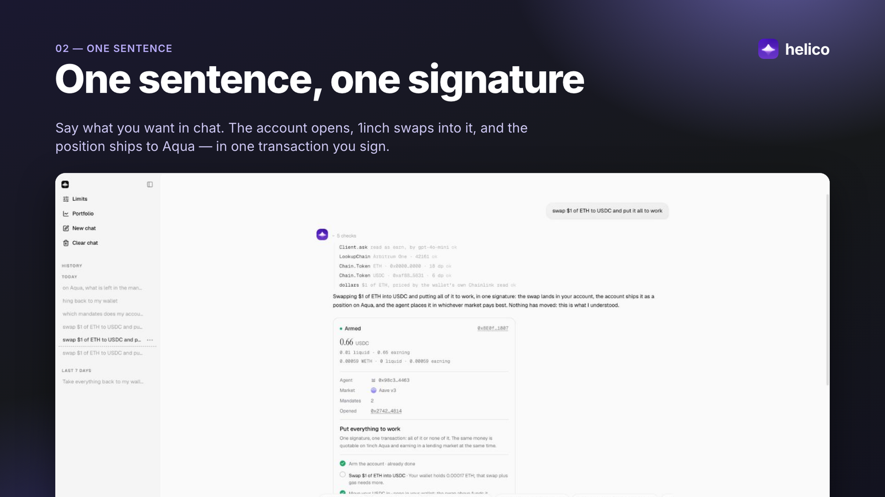
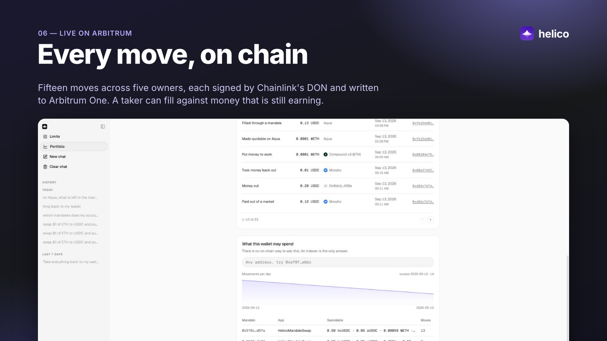

# Helico

**Your funds, on autopilot.** An AI agent keeps your idle capital earning, in a contract account
only you own. It can move money between the markets you allow, and nowhere else.

- App: [app.helico.site](https://app.helico.site) (Arbitrum One)
- Site: [helico.site](https://helico.site) · Docs: [docs.helico.site](https://docs.helico.site)
- Demo video (3:55): [youtube.com/watch?v=if0BzgxOM-I](https://www.youtube.com/watch?v=if0BzgxOM-I)

Built for ETHOnline 2026.

## What it does

You get your own contract account. You name Helico's agent and allow up to four lending markets
(Aave v3, Compound v3 USDC, Compound v3 ETH, Morpho). From then on:

1. **The agent puts idle money to work.** Every five minutes a Chainlink CRE workflow reads your
   account, compares the markets, and moves capital to the one that pays most. The two functions
   it may call have no recipient parameter, so it cannot send anything anywhere.
2. **The money stays spendable.** Your position is also a 1inch Aqua mandate. A taker can swap
   against it while it is lent out: the contract redeems exactly the shortfall from the market
   inside the same transaction.
3. **You can always leave.** "Take everything back to my wallet" sends every token to the one
   address the account was built for. The exit lives in the proxy, so no upgrade can remove it.

One sentence in the chat does all of the setup in one signature:

> swap $10 of ETH to USDC and put it all to work

## Proof, on chain

Every move is a report signed by Chainlink's DON, sent by a DON node to the KeystoneForwarder,
into our agent contract, into the owner's account. Nobody on the team signs any of it.

| | |
|---|---|
| Moves carried | 15, across 5 owners' accounts, by 9 different DON transmitters, one policy hash |
| Fastest | 23 seconds from a fresh wallet's signature to USDC earning in Morpho ([tx](https://arbiscan.io/tx/0xb1f4d9bf239faceda9251747bde970a228b5843a9b757426b7c481221663bf6f)) |
| Fills against lent-out money | 3, each redeeming the shortfall from Morpho inside the swap ([tx](https://arbiscan.io/tx/0xd8dc7dfdfce77c83ea79c9e6eb683cb013939a5f8113af5a10d6936212ff7310)) |
| First move | 11 September, 0.49 USDC into Morpho ([tx](https://arbiscan.io/tx/0x0668c698cf3d396e622a97bfa3e21016de44fb41863fa7cb69b47bd126f9ed27)) |

Every transaction, address, and how it was verified is in [`docs/deployments.md`](docs/deployments.md).

## How it is built

| Partner | What it does here | Check it |
|---|---|---|
| **Chainlink CRE** | The decision. A workflow registered with `handlerInTee` runs on the DON every five minutes; thresholds live in the Vault DON; the verdict leaves as a signed report through the KeystoneForwarder. The portfolio chart prices ether from the ETH/USD feed's own round history. | `cd apps/cre && ./rehearse-idle.sh` · [docs/tracks/chainlink.md](docs/tracks/chainlink.md) |
| **1inch Aqua** | The liquidity. `HelicoMandateSwap` is an Aqua app: tokens stay in the owner's account, Aqua holds a ledger entry, and a fill can redeem from a lending market mid-swap. `HelicoTaker` lets any wallet take. | `bun scripts/check-aqua.ts` · [docs/tracks/1inch.md](docs/tracks/1inch.md) |
| **The Graph** | The questions. Aqua's ledger cannot list a wallet's mandates on chain; our subgraph can. The enclave reads it to size its floor, and the chat reads it through The Graph's MCP server, showing every query it ran. | `bun scripts/check-subgraph.ts` · [docs/tracks/thegraph.md](docs/tracks/thegraph.md) |

Where the code is, pinned to the commit it was read from and checked in CI:

| What | Where |
|---|---|
| The confidential handler | [`index.ts#L470-L596`](https://github.com/0xHelico/helico/blob/f6f2fc6695e030d8a6918a863470299fcb8dd179/packages/plugins/cre/src/index.ts#L470-L596) |
| How much should be earning, and what stops a move | [`decision.ts#L152-L193`](https://github.com/0xHelico/helico/blob/f6f2fc6695e030d8a6918a863470299fcb8dd179/packages/plugins/cre/src/decision.ts#L152-L193) |
| The mandate a maker ships | [`HelicoMandateSwap.sol#L37-L90`](https://github.com/0xHelico/helico/blob/247db3ba454ba058411f958850f38bc7c1739cca/contracts/src/HelicoMandateSwap.sol#L37-L90) |
| The swap: gate, rules, quote, ceiling, settle | [`HelicoMandateSwap.sol#L229-L256`](https://github.com/0xHelico/helico/blob/247db3ba454ba058411f958850f38bc7c1739cca/contracts/src/HelicoMandateSwap.sol#L229-L256) |
| The question the chain cannot answer | [`mandates.ts#L115-L141`](https://github.com/0xHelico/helico/blob/f6f2fc6695e030d8a6918a863470299fcb8dd179/packages/plugins/thegraph/src/mandates.ts#L115-L141) |

## Repo layout

| Directory | Contents |
|---|---|
| [`contracts/`](contracts/) | The account, the Aqua apps, the taker, the lending venues (Foundry) |
| [`apps/app/`](apps/app/) | The dapp (Next.js) |
| [`apps/be/`](apps/be/) | Go backend: chat, sessions, account history, price history, the MCP client |
| [`apps/landing/`](apps/landing/) | The site and docs (Astro) |
| [`apps/cre/`](apps/cre/) | The CRE project and the local rehearsal |
| [`packages/plugins/`](packages/plugins/) | One package per partner: `cre`, `1inch`, `thegraph` |
| [`subgraph/`](subgraph/) | The subgraph indexing Aqua and our factory |
| [`docs/`](docs/) | Deployments, track measurements, and the plans written before the code |

Run it locally with `bun install`, then `bun run test` for the TypeScript and Go suites, and
`forge test` in `contracts/` for the 178 Solidity tests (74 of them on an Arbitrum One fork, so
set `ARBITRUM_RPC_URL`).

## What is not done

- The local rehearsal runs in the CRE simulator, not a TEE. The deployed workflow does run on the DON.
- The dapp's swap card routes through 1inch aggregation; it does not yet fill our own mandates.
  That is [`HelicoTaker`](contracts/src/HelicoTaker.sol) via [`scripts/take-mandate.ts`](scripts/take-mandate.ts) for now.
- Not audited.

## Rules and AI use

Coding rules are in [`CLAUDE.md`](CLAUDE.md). Every AI-assisted change is logged in
[`AI-USAGE.md`](AI-USAGE.md) with what was asked, what changed, and what a person verified.
Implementation plans were committed to [`docs/plans/`](docs/plans/) before the code.

About the history: eleven early merges on `main` were squashed before squash merging was turned
off, so they show as one commit each. Their original commits are still under `refs/pull/N/head`.
